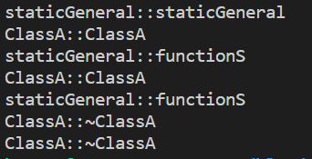

# 싱글톤 패턴(Singleton Pattern)
1. 정의
  - 특정 클래스가 최대 한 번만 인스턴스화 되도록 보장하는 패턴.
2. 사용 목적
  - 인스턴스를 전역 변수로 사용하지 않고도 하나의 객체만 생성하여 메모리 측면에서 이점이 있음.
  - 코드의 가독성이 올라감.
  - 하나의 인스턴스만 생성되고 이미 생성된 인스턴스를 계속 활용하기 때문에 속도 측면에서 이점이 있음.

### 예시 코드
```cpp
#include <iostream>
#include <cstdio>
#include <utility>
#include <memory>

// ---------------- Class staticGeneral  -------------------
class staticGeneral
{
    public :
        static staticGeneral &isntance1() {
            static staticGeneral _sGeneral;
            return _sGeneral;
        };

        static staticGeneral *_instance;

        static staticGeneral *instance2() {
            if(_instance == nullptr) {
                _instance = new staticGeneral();
            }

            return _instance;
    }

        staticGeneral();
        ~staticGeneral();
        void functionS();
};
// 정적 멤버 변수 초기화
staticGeneral* staticGeneral::_instance = nullptr;

staticGeneral::staticGeneral()
{
    printf("staticGeneral::staticGeneral\n");
}

staticGeneral::~staticGeneral()
{
    printf("staticGeneral::~staticGeneral\n");
}

void staticGeneral::functionS()
{
    printf("staticGeneral::functionS\n");
}

// ---------------- Class ClassA  -------------------
class ClassA
{
    public:
        ClassA();
        ~ClassA();
        staticGeneral *m_sGeneral;
        
};

ClassA:: ClassA()
    : m_sGeneral(staticGeneral::instance2())
{
    printf("ClassA::ClassA\n");
    m_sGeneral->functionS();
}

ClassA::~ClassA()
{
    printf("ClassA::~ClassA\n");
}

int main()
{
    ClassA *a = new ClassA();
    ClassA *b = new ClassA();

    delete a;
    delete b;

    return 0;
}
```
### 결과 출력


### 결과에 대한 설명
- ClassA의 객체는 두 번 생성되었고, ClassA의 생성자에서 staticGeneral의 인스턴스를 호출하지만 staticGeneral의 생성자는  한 번만 호출됨.