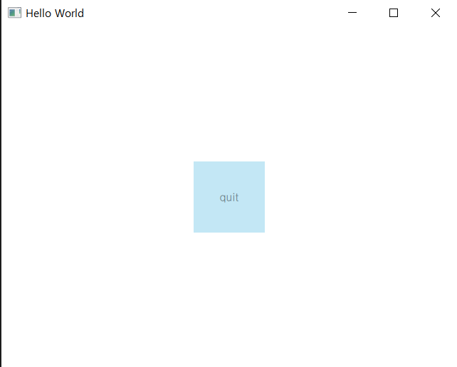
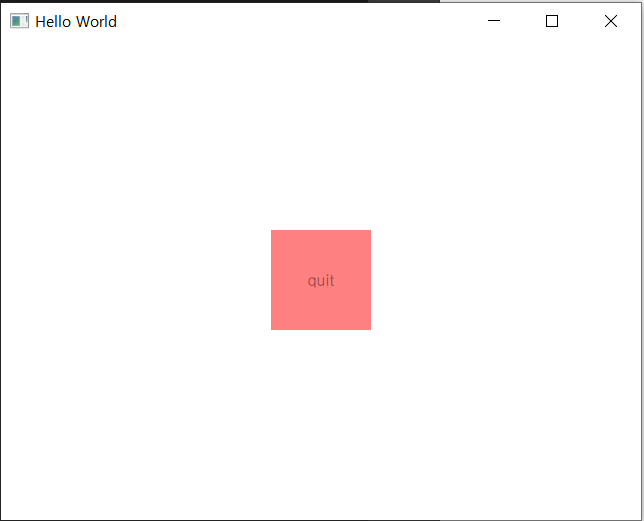

Qt를 통해 ui를 구성할 떄 Widget을 사용한 경험밖에 없다.
 Qt에서 ui를 구성하는 방법은 크게 두 가지로 Widget을 통한 방법가 QML으로 구성하는 방법이 있다.
 QML에 대해 공부해보고자 내용을 정리하고 공부한 내용을 업로드할 게획이다.


## QML(Qt Modeling Language)
- QML은 인터프리터다. 기존 컴파일 후 실행파일이 생성되던 C++(Widget) 방식과 반대이다.
- 디자인과 기능(Logic)을 분리할 수 있다는 장점이 있다.
- 하드웨어적으로 제한되거나(임베디드) 혹은 장비 컴퓨터 시스템 같은 환경에 사용하는 것이 적절하다.
- 바인딩으로 복잡한 로직 없이 값이 최신상태로 유지 가능하다.
- QML은 기존 Widget 방식보다 느리고 무겁지만 이는 충분한 하드웨어의 스펙으로 극복 가능한 요소이다.

## 기본적인 문법
- JavaScript, CSS와 비슷하다는데 잘 모른다. 때문에 직접 소스를 구현해보고 이해보기로 했다.

```qml
import QtQuick 2.14
import QtQuick.Window 2.14
import QtQuick.VirtualKeyboard 2.14

Window {
    id: window
    visible: true
    width: 640
    height: 480
    title: qsTr("Hello World")

    Rectangle {
        id: rect
        color: "sky blue"
        width: 100
        height: 100
        opacity: 0.5

        anchors {
            centerIn: parent
        }

        Text {
            id: rect_text
            width: parent.width
            height: parent.height
            text: qsTr("quit")
            horizontalAlignment: Text.AlignHCenter
            verticalAlignment: Text.AlignVCenter
            anchors{
                centerIn: parent
            }
        }

        MouseArea {
            anchors {
                fill: parent
            }
            onClicked: {
                //Qt.quit()
                parent.color="red"
                console.log("click")
            }
        }
    }
}


```
> 직접 만들어본 소스이다.
>
> 메인 Window의 Size, Caption을 설정하고 가운데 하늘색의 사각형을 만든 후 사각형 클릭 시 빨간색으로 변하도록 구현했다.
>
> 먼저, Rectangle이라는 Type을 생성해준다. Type은 Button, Text등 다양하게 존재한다.
>
> 그 다음, Ractangle의 속성(property)인 id, color, width 등에 값(value)를 넣어준다.
>
> Text의 경우, 부로 객체로부터 속성을 참조(Reference)하여 속성으로 가지게 하였다.
>
> 객체 간의 상호 작용이나 이벤트를 위해 호출되는 함수를 신호(Signal)이라 한다. 위 소스에서는 MouseArea가 Button 클릭에 대한 이벤트 처리부분이다.


### 결과 출력

> 처음 실행하면 나오는 ui


> 버튼을 눌렀을 때 버튼 색 변화

- 간단한 소스를 작업하면서 앵커(anchors)를 통한 배치, 마우스 이벤트 처리등을 어떻게 구현하는지 이해했다.

