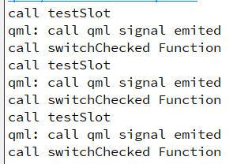

이번엔 QML과 cpp 파일간 상호작용을 구현해 보았다.  
기존 ui(Widget) 기반으로 UI를 구성할 때, 사용하던 SIGNAL/SLOT 방식과 큰 차이가 없는거 같다.

> callqml.h  

```cpp
#ifndef CALLQML_H
#define CALLQML_H

#include <QObject>
#include <QDebug>

class callqml: public QObject
{
    Q_OBJECT
public:
    callqml();
    ~callqml();

    Q_INVOKABLE void switchChecked();

signals:
    void testSignal();

public slots:
    void testSlot();
};

#endif // CALLQML_H
```

> callqml.cpp

```cpp
#include "callqml.h"

callqml::callqml()
{

}

callqml::~callqml()
{

}

void callqml::switchChecked()
{
    qDebug() << "call switchChecked Function";
}

void callqml::testSlot()
{
     qDebug() << "call testSlot";
     emit testSignal();
}
```

##### qml과 상호작용하기 위해 만든 클래스
  - signal, slot을 사용하는 방식은 .ui(Widget)과 크게 다르지 않다.
  - emit을 통해 SIGNAL을 발생하면 해당 SIGNAGL과 연결된 slot을 호출한다.(콜백함수랑 비슷한 개념인데 나중에 조만간 정리 해봐야겠다.)
  - Q_INVOKABLE은 Qt에서 사용되는 매크로로, 클래스의 메서드를 Qt 메타 오브젝트 시스템에서 호출 가능한 함수로 만들기 위해 사용된다고 한다. 함수를 slot처럼 사용 가능하도록 만들어주는 매크로라고 이해하면 편할 것 같다.
  - testSlot()이 호출되면 SIGNAL 발생하도록 함.

> main.cpp

```cpp
#include <QGuiApplication>
#include <QQmlApplicationEngine>
#include <QQmlContext>
#include "callqml.h"

int main(int argc, char *argv[])
{
    QCoreApplication::setAttribute(Qt::AA_EnableHighDpiScaling);

    QGuiApplication app(argc, argv);

    QQmlApplicationEngine engine;

    const QUrl url(QStringLiteral("qrc:/main.qml"));

    QObject::connect(&engine, &QQmlApplicationEngine::objectCreated,
                     &app, [url](QObject *obj, const QUrl &objUrl) {
        if (!obj && url == objUrl)
            QCoreApplication::exit(-1);
    }, Qt::QueuedConnection);

    engine.load(url);
    callqml cq;
    engine.rootContext()->setContextProperty("callqml", &cq);

    return app.exec();
}
```
main.cpp를 하나하나 설명하자면 

```cpp
QGuiApplication app(argc, argv);
```
- Qt Quick 기반 애플리케이션의 GUI를 초기화하는 객체를 생성.

```cpp
QQmlApplicationEngine engine;
```
- QML 엔진을 사용하기 위해 QQmlApplicationEngine의 객체 생성.

```cpp
const QUrl url(QStringLiteral("qrc:/main.qml"));

QObject::connect(&engine, &QQmlApplicationEngine::objectCreated,
                 &app, [url](QObject *obj, const QUrl &objUrl) {
    if (!obj && url == objUrl)
            QCoreApplication::exit(-1);
}, Qt::QueuedConnection);

engine.load(url);
```
- 애플리케이션에 로드할 qml 파일의 경로를 지정.  
- objectCreated 시그널에 대한 SLOT을 연결하여 QML 엔진이 객체를 생성할 떄의 이벤트를 처리.
- 엔진에 QML을 로드

```cpp
callqml cq;
engine.rootContext()->setContextProperty("callqml", &cq);
```
- 이 부분이 핵심인데, engine에 callqml의 객체 cq를 등록하여 qml에서 cq 객체에 접근할 수 있게 해주는 것이다.

> CustomSwitch.qml

```qml
import QtQuick 2.14
import QtQuick.Controls 2.12

Switch {
    id: myswitch
    property color checkedColor: "#0ACF97"
    checked: true

    indicator: Rectangle{
        width: 108
        height: 64
        radius: height/2
        border.width: 2
        border.color: myswitch.checked ? checkedColor:"#E5E5E5"

        Rectangle {
            x: myswitch.checked ? parent.width - width - 2 : 1
            width: myswitch.checked ? parent.height -4 : parent.height - 2
            height: width
            radius: width/2
            anchors.verticalCenter: parent.verticalCenter
            color:"white"
            border.color:"#D5D5D5"

            Behavior on x {
                NumberAnimation {duration:200}
            }
        }
    }

    onCheckedChanged : {
        if(checked) {
            callqml.switchChecked()
        } else {
            callqml.testSlot()
        }
    }

    Connections {
        target: callqml
        onTestSignal: {
            console.log("call qml signal emited");
        }
    }
}
```
#### Switch를 통해 callqml의 객체 cq의 SLOT과 Q_INVOKABLE 매크로가 적용된 함수를 호출하고 cq에서 SIGNAL이 발생했을 때 연결된 동작이 작동하도록 했다.

> callqml의 SLOT과 Q_INVOKABLE 함수 호출

```qml
onCheckedChanged : {
    if(checked) {
        callqml.switchChecked()
    } else {
        callqml.testSlot()
    }
}
```
- 스위치가 Check되면 매크로 함수, Uncheck되면 SLOT을 호출.

> callqml의 testSignal() 발생 시, 동작 정의

```qml
Connections {
    target: callqml
    onTestSignal: {
        console.log("call qml signal emited");
    }
}
```
- 시그널 이름 앞에 on을 붙여줘서 정의한다.
- 시그널 첫 앞글자는 대문자로 해줘야 에러가 발생하지 않는다.
- UnCheck 되면 testSlot()에서 시그널이 발생될 것.

> main.qml

```qml
import QtQuick 2.14
import QtQuick.Window 2.14
import QtQuick.Layouts 1.3
import QtQuick.Controls 2.5

Window {
    visible: true
    width: 640
    height: 480
    title: qsTr("Button Test")

    CustomSwitch {
        anchors.centerIn: parent
    }
}
```
- CustomSwitch를 MainWindow의 중앙에 배치.

### 결과


### 결과2

